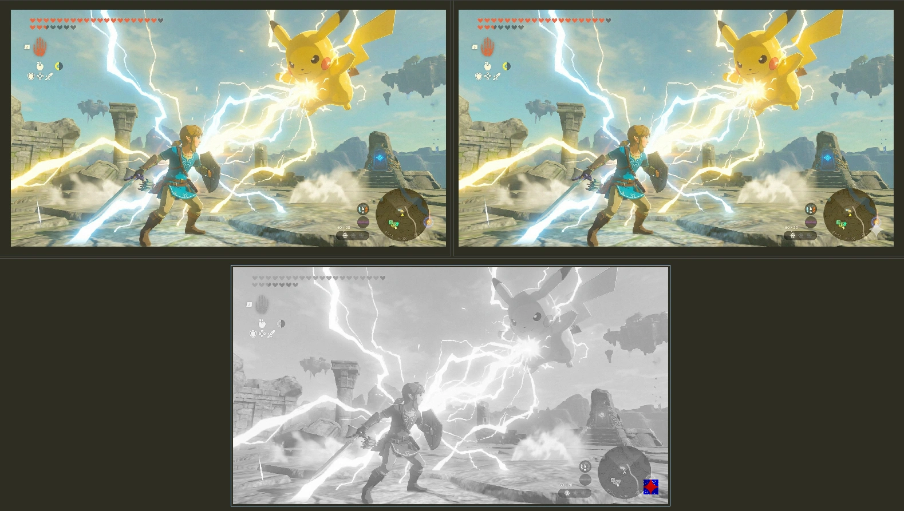
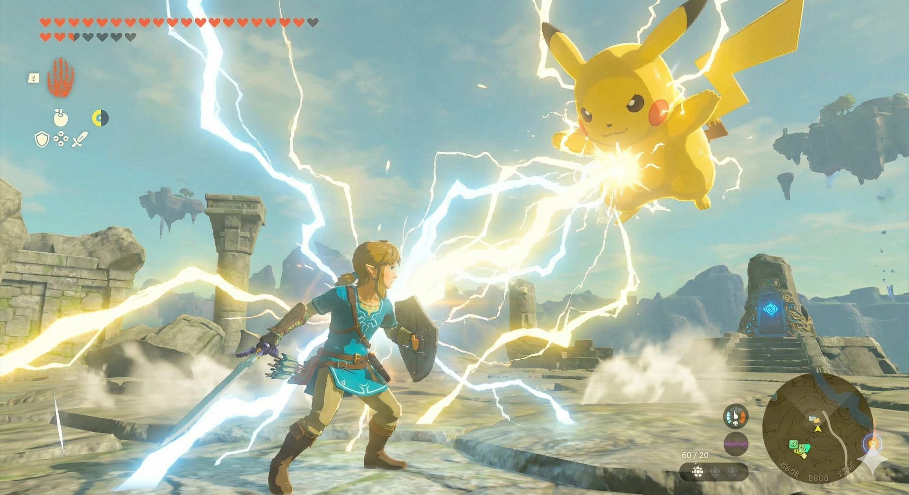
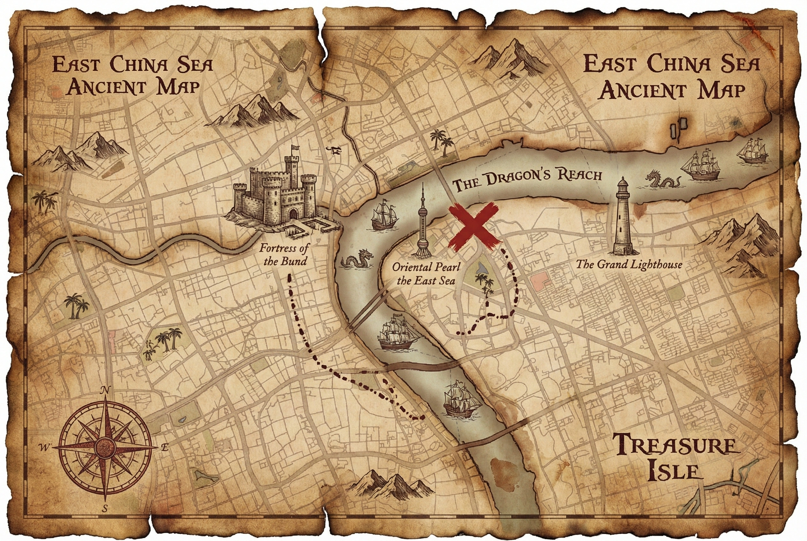
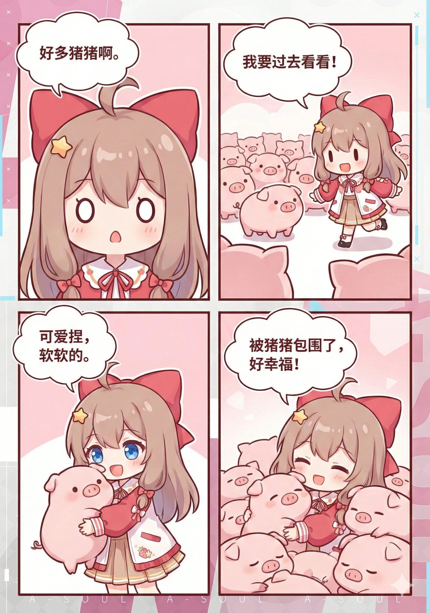

# Bla Trace - Lossless Watermark Removal Tool

A high-performance, 100% client-side tool for removing watermarks. Built with pure JavaScript, it leverages a mathematically precise **Reverse Alpha Blending** algorithm for lossless results.

[](https://app.netlify.com/start/deploy?repository=https://github.com/CallMeHoussam/BlaTrace)

## Features

- ✅ **100% Client-side** - No backend, no server-side processing. Your data stays in your browser.
- ✅ **Privacy-First** - Images are never uploaded to any server. Period.
- ✅ **Mathematical Precision** - Based on the Reverse Alpha Blending formula, not "hallucinating" AI models.
- ✅ **Auto-Detection** - Intelligent recognition of 48×48 or 96×96 watermark variants.
- ✅ **User Friendly** - Simple drag-and-drop interface with instant processing.
- ✅ **Cross-Platform** - Runs smoothly on all modern web browsers.

## Examples

<details open>
<summary>Click to Expand/Collapse Examples</summary>
　
<p>lossless diff example</p>
<p></p>


<p>example images</p>

| Original Image | Watermark Removed |
| :---: | :----: |
|  |  |
|  |  |
|  |  |
|  |  |
|  |  |

</details>

## ⚠️ Disclaimer

> [!WARNING]
>  **USE AT YOUR OWN RISK**
>
> This tool modifies image files. While it is designed to work reliably, unexpected results may occur due to:
> - Variations in Gemini's watermark implementation
> - Corrupted or unusual image formats
> - Edge cases not covered by testing
>
> The author assumes no responsibility for any data loss, image corruption, or unintended modifications. By using this tool, you acknowledge that you understand these risks.


## Usage

1. Open the application.
2. Drag and drop or click to select your image.
3. The engine will automatically process and remove the watermark.
4. Download the cleaned image.

## Development

```bash
# Install dependencies
pnpm install

# Development build
pnpm dev

# Production build
pnpm build

# Local preview
pnpm serve
```

## Detection Rules

| Image Dimension Condition | Watermark Size | Right Margin | Bottom Margin |
| :--- | :--- | :--- | :--- |
| Width > 1024 **AND** Height > 1024 | 96×96 | 64px | 64px |
| Otherwise | 48×48 | 32px | 32px |

## Project Structure

```text
BlaTrace/
├── public/
│   ├── index.html         # Main page
├── src/
│   ├── core/
│   │   ├── alphaMap.js    # Alpha map calculation logic
│   │   ├── blendModes.js  # Implementation of Reverse Alpha Blending
│   │   └── watermarkEngine.js  # Main engine coordinator
│   ├── assets/
│   │   ├── bg_48.png      # Pre-captured watermark map
│   │   └── bg_96.png      # Pre-captured watermark map
│   ├── i18n/              # Language files
│   ├── app.js             # Entry point
│   └── i18n.js            # i18n utilities
├── dist/                  # Build output
├── build.js               # Build script
└── package.json
```

## Core Modules

### alphaMap.js

Calculates the Alpha channel by comparing captured watermark assets:

```javascript
export function calculateAlphaMap(bgCaptureImageData) {
    // Extract max RGB channel and normalize to [0, 1]
    const alphaMap = new Float32Array(width * height);
    for (let i = 0; i < alphaMap.length; i++) {
        const maxChannel = Math.max(r, g, b);
        alphaMap[i] = maxChannel / 255.0;
    }
    return alphaMap;
}
```

### blendModes.js

The mathematical core of the tool:

```javascript
export function removeWatermark(imageData, alphaMap, position) {
    // Formula: original = (watermarked - α × 255) / (1 - α)
    for (let row = 0; row < height; row++) {
        for (let col = 0; col < width; col++) {
            const alpha = Math.min(alphaMap[idx], MAX_ALPHA);
            const original = (watermarked - alpha * 255) / (1.0 - alpha);
            imageData.data[idx] = Math.max(0, Math.min(255, original));
        }
    }
}
```

## Browser Compatibility

- ✅ Chrome 90+
- ✅ Firefox 88+
- ✅ Safari 14+
- ✅ Edge 90+

Required APIs:
- ES6 Modules
- Canvas API
- Async/Await
- TypedArray (Float32Array, Uint8ClampedArray)

---

## License

## License

[MIT License](./LICENSE)
